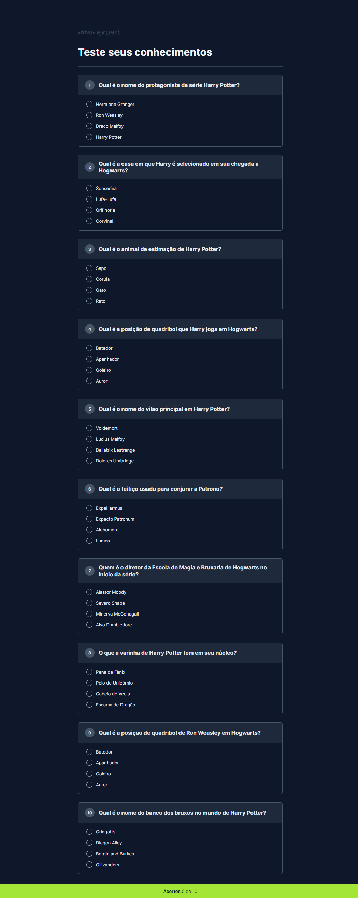

<h1></h1>

Programa exclusivo e gratuito, promovido pela Rocketseat para ensino de tecnologias WEB.</a>

  <a href="#-tecnologias">Tecnologias</a>&nbsp;&nbsp;&nbsp;|&nbsp;&nbsp;&nbsp;
  <a href="#-projeto">Projeto</a>&nbsp;&nbsp;&nbsp;|&nbsp;&nbsp;&nbsp;
  <a href="#-layout">Layout</a>

 

  

 

## 🚀 Tecnologias

Esse projeto foi desenvolvido com as seguintes tecnologias:

- HTML 
- CSS
- JavaScript
- Git 
- Github
- Figma

## 💻 Projeto

Projeto prático de uma Quiz utilizando IA para gerar array de perguntas con respostas certas.

- [Acesse o projeto finalizado, online](https://hugolinobg.github.io/Quiz/)

## 🔖 Layout

Você pode visualizar o layout do projeto através [DESSE LINK](https://www.figma.com/community/file/1336455726859616027/nlw-expert-quiz). É necessário ter conta no [Figma](https://figma.com) para acessá-lo.

## ✉️ [Contato](https://links.hugolino.dev) 

hugolino2609@gmail.com
